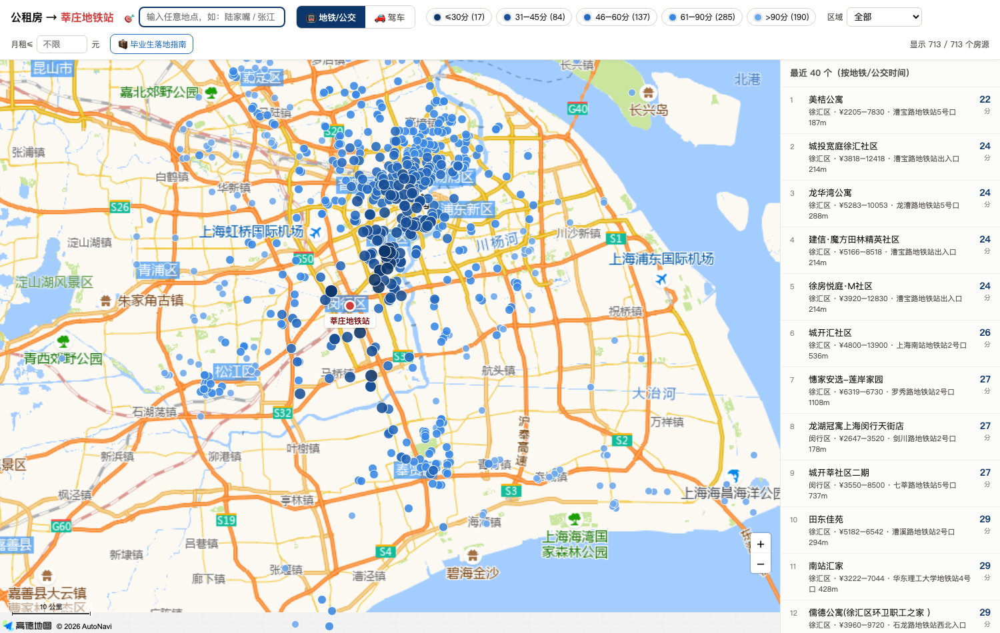
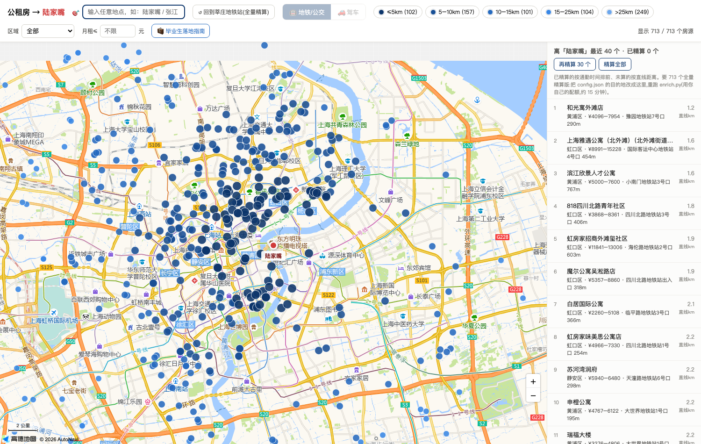

# 来上海落地包：公租房通勤地图 + 毕业生落地指南

刚毕业要来上海？这个仓库给你两件工具：

1. **🗺 公租房通勤地图**（`map.html`）：输入你的通勤目的地（公司/学校/地铁站），把全上海 700+ 个公租房/保租房项目按"离你有多近"排出来，画在一张可交互的地图上——地铁/驾车双模式、真实路线时间、租金户型电话全都有；
2. **🧳 毕业生落地指南**（`guide.html`）：**零配置，下载后双击就能用**——应届生落户直通道自测 + 72 分计算器、居住证积分 120 分速算、保租房/公租房/市场租房三条路线对比（含公积金租房提取攻略、避坑清单）、落地 30 天可勾选清单。

地图需要免费注册高德 Key（教程在下面）；不用会写代码，跟着点鼠标就能跑起来。会用 AI 助手（Claude Code / Codex / WorkBuddy / Trae）的话，把本文末尾的提示词粘给它，5 分钟配完。

| 全量精算模式（默认目的地） | 任意目的地模式（示例：陆家嘴） |
|---|---|
|  |  |

## 它能干什么

- **按通勤时间给房源着色排序**：地铁/公交和驾车两套时间，来自高德的真实路线规划，不是直线距离拍脑袋；
- **地图上换任意目的地**：搜索框输入任意地点（或右键地图选点），713 个房源立刻按直线距离重排，并自动对最近的 30 个实算真实通勤时间；
- **每个房源可点开**：租金、户型、面积、最近地铁站与步行距离、管家电话、一键跳高德导航；
- **导出 Excel 排名表**（result.csv），想怎么筛怎么筛。

自带 2026 年 7 月的上海公租房房源快照（`listings.csv`，713 条，含各区公租房与保障性租赁住房项目）。房源信息会过时，怎么更新见[下文](#更新房源数据)。

## 你需要准备什么

1. 一个**高德开放平台**免费账号（下面教你注册，个人实名即可，免费额度绰绰有余）；
2. 电脑上有 **Python 3.9 或更新版本**（本项目零第三方依赖，不用 pip 装任何东西）：
   - **Mac**：系统自带，打开「终端」输入 `python3 --version` 确认；
   - **Windows**：去 [python.org/downloads](https://www.python.org/downloads/) 下载安装，**安装时勾选 "Add Python to PATH"**，然后在「命令提示符」输入 `python --version` 确认；
3. 大约 20 分钟（其中 15 分钟是程序自己在跑，你可以去倒杯水）。

---

## 第一步：注册高德，创建两个 Key（约 5 分钟）

1. 打开 [高德开放平台](https://lbs.amap.com/)，右上角注册/登录（支付宝或手机号即可），完成**个人开发者实名认证**；
2. 进入 [控制台 → 应用管理 → 我的应用](https://console.amap.com/dev/key/app)，点「创建新应用」，名称随意（比如"公租房"）；
3. 在这个应用下点「添加 Key」，**要创建两个**：

| # | Key 名称(随意) | 服务平台(关键!) | 用途 |
|---|---|---|---|
| 1 | 比如"公租房-算路" | **Web服务** | 给 `enrich.py` 批量算通勤用 |
| 2 | 比如"公租房-地图" | **Web端(JS API)** | 给网页地图用。创建后列表里会多出一个**安全密钥**，和 Key 配对，两个都要复制 |

> 常见坑：两个 Key 的"服务平台"千万别选反。选错的表现是程序报 `INVALID_USER_KEY` 或地图白屏。
>
> 免费额度：个人认证后每类服务约 5000 次/天、并发 3 次/秒。跑一遍 713 个房源约用 2200 次，完全够；程序内置了限速，不会超频。

## 第二步：下载本项目，填入 Key（约 3 分钟）

1. 下载项目：点本页右上角绿色 `Code` 按钮 → `Download ZIP`，解压到任意文件夹（会 git 的直接 clone）；
2. 把文件夹里的 `config.example.json` **复制一份，改名为 `config.json`**；
3. 用任意文本编辑器（Mac：文本编辑；Windows：记事本）打开 `config.json`，填三个值和你的目的地：

```json
{
  "amap_web_key": "第一步创建的【Web服务】Key",
  "amap_js_key": "第一步创建的【Web端(JS API)】Key",
  "amap_js_security_code": "与JS API Key配对的【安全密钥】",
  "destination_name": "莘庄地铁站",
  "city": "上海"
}
```

`destination_name` 就写你每天要去的地方，比如"张江高科地铁站"、"陆家嘴"、"复旦大学邯郸校区"，越具体越好。

## 第三步：运行（一共两条命令）

打开命令行，进入项目文件夹：

- **Mac**：打开「终端」，输入 `cd `（cd 后面有个空格），把项目文件夹拖进终端窗口，回车；
- **Windows**：打开项目文件夹，在地址栏输入 `cmd` 回车（会在当前目录打开命令提示符）。

然后依次运行：

```bash
# Mac 用 python3,Windows 用 python
python3 enrich.py       # 第 1 条:算通勤。约 15-30 分钟,进度会一直打印
python3 build_map.py    # 第 2 条:生成地图。1 秒出结果
```

说明：

- `enrich.py` **支持断点续传**——中途断网、按 Ctrl+C 中止、配额用完，都没关系，重新运行会接着上次的进度跑；
- 跑完会生成 `result.csv`（Excel 可开的排名表）和 `enrich_cache.json`（缓存）；
- `build_map.py` 生成 **`map.html`**——双击它，浏览器打开就是你的通勤地图。

## 第四步：怎么用这张地图

- 顶部**色块图例**：颜色越深离目的地越近，点色块可以隐藏/显示对应档位；
- **区域下拉 + 月租上限**：组合筛选；
- **🎯 搜索框**：输入任意新目的地（或**右键地图**任意位置），全部房源立刻按直线距离重排，右侧列表自动逐个"点亮"真实通勤时间（默认精算最近 30 个，可点"再精算 30 个"继续）；
- 点任何圆点：租金/户型/最近地铁站/管家电话/跳高德导航；
- 进阶：给 `map.html` 的地址栏结尾加 `#dest=经度,纬度,名称` 可以直达某个目的地视图。

> ⚠️ **map.html 里内嵌了你的 JS Key**。发给亲友没问题，但不要公开上传到网上。要做公开服务，请在高德控制台给 JS Key 绑定域名白名单，并把安全密钥改为服务端代理模式（`_AMapSecurityConfig.serviceHost`）。

---

## 🧳 附赠:毕业生落地指南(不用配任何 Key)

`guide.html` 是纯静态页面,下载仓库后**直接双击打开**即可,含六个模块:

1. **落户自测**:先判定你是否命中应届生**直接落户**通道(博士/双一流硕士/在沪一流大学本科/五个新城就业等),没命中再用 **72 分计算器**估分;附受理窗口提醒(只在毕业当年!)与替代路径;
2. **居住证积分速算**:本科有学位(90 分)+年龄(30 分)=120 达标——很多毕业生不知道自己"白送"达标;
3. **租房路线图**:保租房(毕业 2 年内凭毕业证可申、约市场 9 折)→公租房(配合本项目地图挑)→市场租房(6 条避坑),附**公积金租房月提取 4000 元**设置方法和各区人才补贴查询姿势;
4. **求职与到手工资**:上海版**到手工资计算器**(2025-2026 社保公积金基数+个税,含公积金双边入账视角)、应届 offer 薪资数据去哪查、签约六大坑(培训贷/传销/试用期/应届身份与社保);
5. **就医指南**:公立三甲"白名单思维"+按毛病找医院速查表、官方挂号渠道、**莆田系识别五特征**(附 GitHub 众包名单仓库及其时效性提醒)、962525 心理热线;
6. **落地 30 天清单**:12 件事按顺序勾,进度自动保存(居住登记等有硬时限的事项已标红)。

> 政策数值为 2026-07 整理,页面内每个模块都附了官方来源链接;政策每年更新,正式申报以当年官方文件为准,欢迎 PR 修订。

---

## 🤖 懒人路线：让 AI 助手替你跑完全程

如果你在用 AI 编程助手，整个教程可以浓缩成一段提示词。先把下面的模板填好空：

```text
帮我跑通一个开源项目「上海公租房通勤地图」。
项目地址:https://github.com/USERNAME/gzf-commute-map (或:我已下载解压到 ___ )
我的通勤目的地:___(例:张江高科地铁站)
高德 Web服务 Key:___
高德 JS API Key:___
JS API 安全密钥:___

请你:
1. 把项目下载/解压到本地(已给路径就跳过);确认 Python 3.9+ 可用,没有就先帮我装;
2. 复制 config.example.json 为 config.json,把上面四个值填进去;
3. 运行 enrich.py(要 15-30 分钟,有进度输出;它支持断点续传,中断就重跑);
4. 运行 build_map.py 生成 map.html 并帮我打开;
5. 读 result.csv,告诉我离目的地最近的 10 个房源(名称/通勤时间/租金)。
注意:不需要安装任何第三方 Python 库;两个 Key 类型不同,别填反。
```

各家助手怎么打开：

| 助手 | 入口 |
|---|---|
| **Claude Code**（Anthropic） | 终端进入项目文件夹后运行 `claude`，粘贴提示词。（本项目就是它写的 🙂） |
| **Codex CLI**（OpenAI） | 终端进入项目文件夹后运行 `codex`，粘贴提示词 |
| **WorkBuddy**（腾讯） | 新建对话，把项目文件夹授权/共享给它，粘贴提示词 |
| **Trae**（字节） | 用 Trae 打开项目文件夹，切到 Builder 模式，粘贴提示词 |

哪家都行——脚本零依赖、报错信息都是中文人话，AI 助手照着跑不会迷路。

---

## 更新房源数据

`listings.csv` 是 2026-07 的快照。房源每月都有上下架，更新方法：

1. 用 Excel/WPS 打开 `listings.csv`（前四列必填：**项目名称、区域、地址**，其余选填：户型、最低租金、最高租金、最小面积、最大面积、联系电话）；
2. 各区公租房运营机构的官网/公众号会公示当期房源，增删改行即可（保持表头不动，另存为 CSV UTF-8 格式）；
3. 重新跑 `python enrich.py`——**已经算过的地址不会重算**，只补新增的，很快。

换了 `destination_name` 再跑 `enrich.py`，会自动作废旧的通勤数据、全部重算（地理编码不用重来）。

## 常见问题

- **报 INVALID_USER_KEY**：`config.json` 里 `amap_web_key` 填成了 JS API 类型的 Key（或复制时带了空格）。两个 Key 别填反。
- **地图打开是白屏**：JS Key 和安全密钥没配对，或 `amap_js_security_code` 没填。F12 控制台会有 `INVALID_USER_SCODE` 字样。
- **报"今日配额用完"**：免费额度按天重置，明天重跑 `enrich.py` 自动续传补齐。
- **通勤时间和我实际体验不一样**：批量计算用的是**跑程序当时**的路况（建议白天跑）；地铁时间受高峰影响小，驾车早晚高峰请自行上浮 50%~100%。
- **想用在其他城市**：改 `config.json` 的 `city`，并替换 `listings.csv` 为你的房源表即可跑通主流程；`enrich.py` 里的行政区校验表（BOX/ADCODE）是上海专用的，其他城市会自动跳过校验（定位精度略降），欢迎 PR 补充你的城市。
- **数据从哪来/准不准**：房源快照由个人从各区公租房运营机构的公开公示整理，仅供找房参考，以运营机构最新公示为准；本项目不含任何个人隐私数据。

## 项目文件一览

```
gzf-commute-map/
├── README.md              本教程
├── guide.html             毕业生落地指南(零配置,双击即用)
├── config.example.json    配置模板(复制为 config.json 后填 Key)
├── listings.csv           房源表(自带上海公租房快照,可自行更新)
├── enrich.py              第 1 步:批量计算通勤(高德 Web 服务 API)
├── build_map.py           第 2 步:生成交互地图 map.html
└── docs/                  截图
```

## 致谢与许可

- 地图与路线数据：[高德开放平台](https://lbs.amap.com/)（JSAPI 集成方式参考其官方 [amap-jsapi-skill](https://github.com/AMap-Web/amap-skills)）
- 许可证：MIT（`listings.csv` 房源快照整理自公开公示信息，随项目一并开放）
